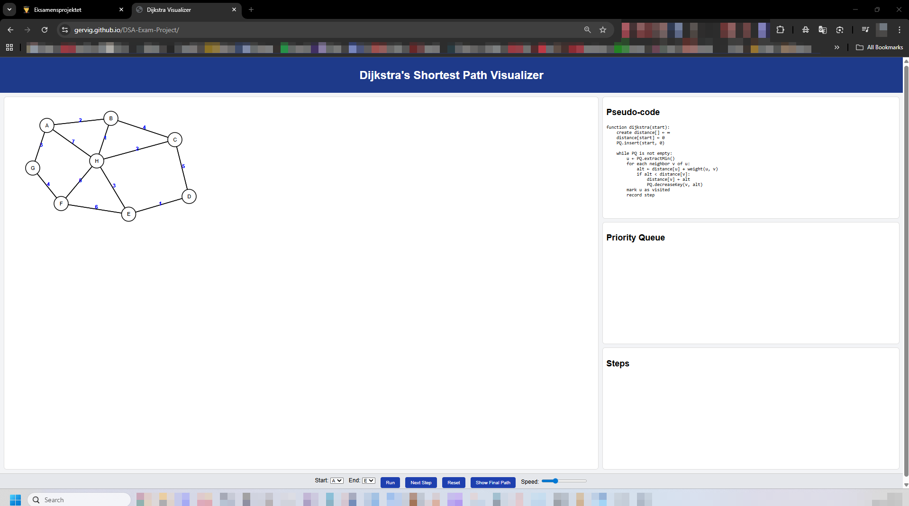

# DSA Exam Project
EK Exam project for DSA 2025

  

# Short explanation of the project:

This project is an interactive visual tool that shows how the Dijkstra algorithm finds the shortest route between two points. You can choose two nodes, and the program animates the steps the algorithm goes through, explaining each decision it makes. It’s basically a way to watch the computer ‘think’ as it figures out the best path.

# Link for deployed version: https://gervig.github.io/DSA-Exam-Project/
